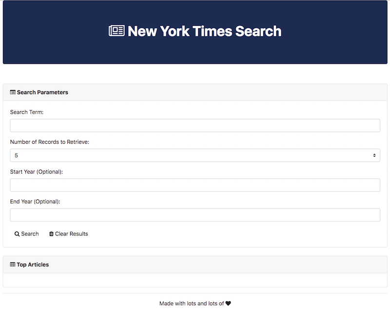

# NYT Search App - Phase I

## Instructions:

**UI:**

Create the layout for the design above. Feel free to use Bootstrap or to do something more customized of your own.

Make sure to organize your code so as to have the necessary IDs.

Incorporate text boxes for capturing User Input. Then research how to retrieve the input values in JavaScript

**Data:**

Do preliminary research on the [API](http://developer.nytimes.com/article_search_v2.json).

Register for an API Key if you have not already done so.

Understand what format the URL should look like to make an Article Call. (Hint: Use the API Console!!)

Experiment with console logging various fields.

From time to time, offer the below helpful HINTs to students who may be stuck.

All of you should be using the [API Console](http://developer.nytimes.com/article_search_v2.json#/Console/GET/articlesearch.json). The console allows you to create "test URLs". This way you can confirm that you are pinging the right URL.

For the data, use hard-coded values whenever you can first. Then switch into "dynamic" URL construction.

Notice that you can't actually specify the Number of Records to Retrieve on the API side -- this means that instead you will need to filter records on the JavaScript side (using For-Loops)

Notice that the the NYT API responds with a sub-object called `response`. This means if you are using the traditional variable `response` to hold your data, you will need to reference individual entries as `response.response...`. You can avoid this if you store the object in something other than a variable called `response`.

